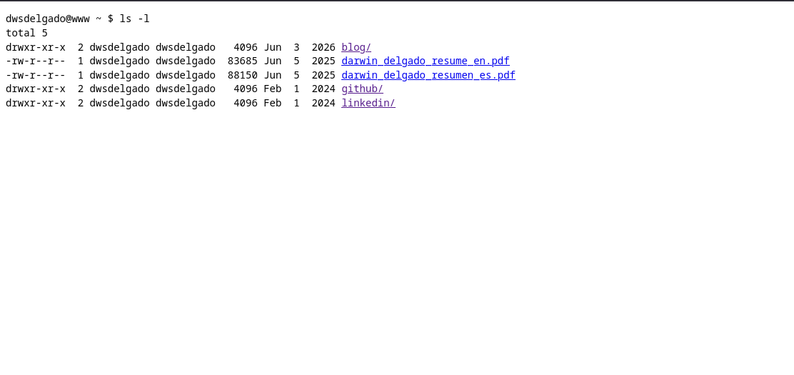

# Darwin Delgado — Portfolio V3

<div align="center">
  
</div>

<br />

Portafolio personal construido con Astro, Tailwind CSS y desplegado en Cloudflare Pages.

## Inicio rápido

### Instalación

```bash
pnpm install
```

### Desarrollo

```bash
pnpm dev
```

El sitio estará disponible en `http://localhost:4321`

## Scripts disponibles

| Comando | Acción |
| :--- | :--- |
| `pnpm install` | Instala dependencias |
| `pnpm dev` | Servidor de desarrollo en `localhost:4321` |
| `pnpm build` | Genera el sitio en `./dist/` |
| `pnpm preview` | Vista previa del build en local |

## Personalización

Edita los archivos en `src/data/` para actualizar el contenido:

- **`me.json`** — Información personal y contacto
- **`experience.json`** — Experiencia laboral
- **`projects.json`** — Proyectos
- **`certifications.json`** — Certificaciones
- **`links.json`** — Redes sociales

## Despliegue en Cloudflare Pages

1. Sube el proyecto a GitHub
2. Ve a [Cloudflare Dashboard](https://dash.cloudflare.com) → Workers & Pages → Create → Pages
3. Conecta el repositorio de GitHub
4. Configura el build:
   - **Framework**: Astro
   - **Build command**: `pnpm build`
   - **Output directory**: `dist`
5. Deploy

## Contacto

- **LinkedIn**: [dwsdelgado](https://linkedin.com/in/dwsdelgado)
- **GitHub**: [@dwsdelgado](https://github.com/dwsdelgado)
